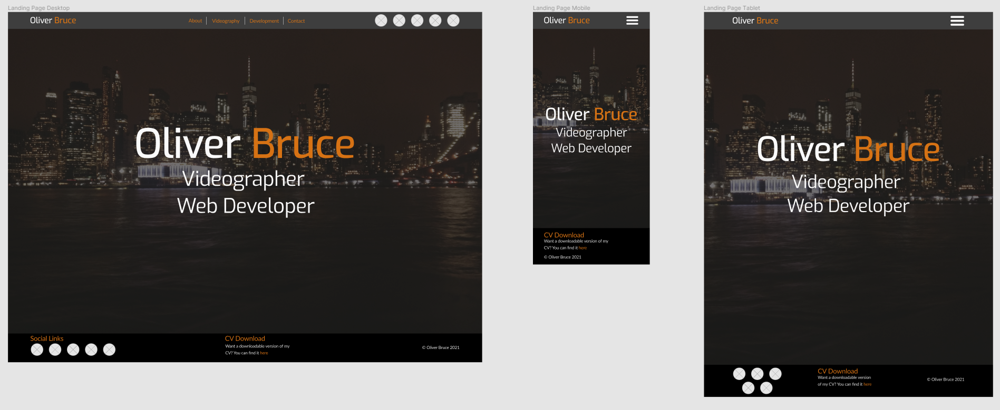
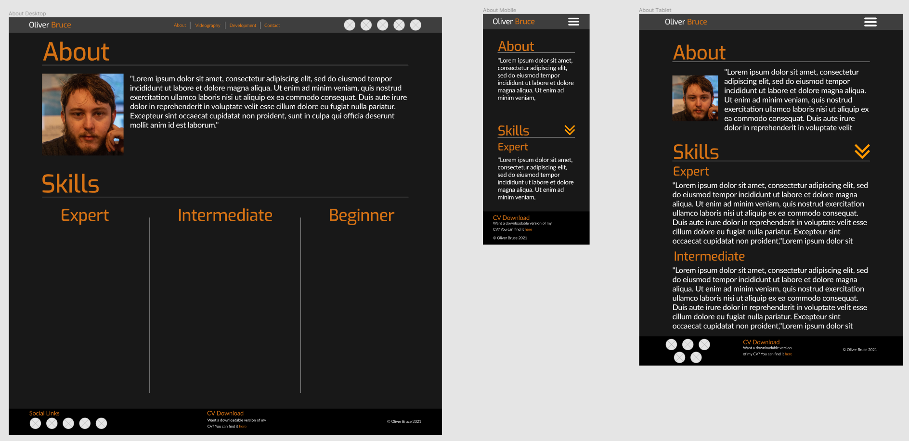
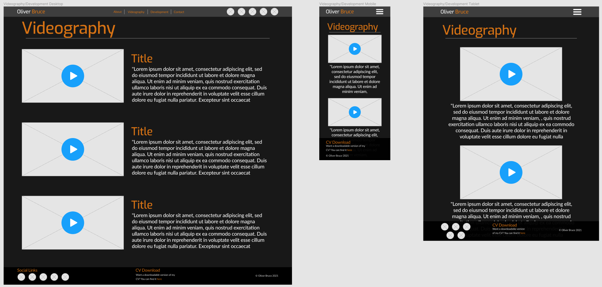

# Milestone Project 1 - Portfolio Website

## Introduction

[View the live project here.](https://ollie-bruce.github.io/ms1-portfolio/)

This website was designed with the intent of providing Oliver Bruce, the developer, with an easy-to-access resource that archives both videography works and web development projects alongside key information for future employers in both fields.

For the purposes of the Code Institute Web Application Development Diploma, this is the first of four Milestone Projects, wherein the requirements were to make a responsive website of at least three pages primarily using **HTML** and **CSS**.

----

## UX

### User Demographics

There are two key demographics for this website:

* **Oliver Bruce** as the site owner

* **Future employers of Oliver**

### User stories

#### As Oliver, I want:

1. To easily provide employers with a showcase of my best work.
2. To easily provide employers with information about myself and my skills.
3. To easily provide employers access to my CV and contact information.
4. A professional, clean layout that is itself a showcase of my abilities.
5. An easy-to-access archive of my work that I can refer back to and edit with ease.

#### As a future employer, I want:

1. Easy access to the body of Oliver's work relevant to the field in which he has applied for.
   * Separate pages for Videography and Development projects, clearly delineated.
2. Easy access to information about Oliver's skillset.
3. Easy access to Oliver's CV and contact information.
   * A separate link for Oliver's CV for future record-keeping and in-depth information.
   * A separate contact page.
4. A demonstration of some of Oliver's skills via the website itself.

As such, when determining **strategy**, the following factors were taken into account:

* The primary demographic of the website are professionals in the creative industries, either as web developers or videographers.
* These professionals, as future employers, are most likely to be in a position of management in order to have say over hiring decisions, putting their ages between 25-35 years.
* They will value professionalism and modern aesthetic sensibilities (i.e. no cluttered designs or too loud colours).
* The website needs to allow easy access to whatever information employers will need to see if Oliver is suitable for a job he has applied for.
* The website needs to provide as in-depth an insight possible into the body of Oliver's work across both videography and web development for practical demonstration of the skills he claims to have.

This then helped the developer to define the **scope** of the project and what would features would need to be included:

#### Users will need access to:

* A summary of Oliver's skills in both videography and web development.
* Oliver's CV
* A videography portfolio
* A web development portfolio
* Oliver's contact details/a way to contact Oliver directly.

#### In terms of function the website will need to:

* Allow the user to easily find whatever information they are looking for.
* Allow the user to easily find external links to:
  * YouTube videos
  * GitHub repos
* Provide a direct download link for Oliver's CV in a common file format in an accessible manner.
* Give users an avenue through which to contact Oliver, either:
  * Through contact information provided in his CV.
  * Through a direct Contact page on the website.

As such, a **structure** was then decided upon for the website:

#### Landing Page

* Name and Professions

#### About

* Photo
* Bio
* Skills summary

#### Videography

* Links to videos produced by Oliver (YouTube Embeds)
* Short blurbs describing videos

#### Development

* Links to GitHub repos/websites developed by Oliver
* Short blurbs describing projects

#### Contact Me

* A contact form

On all pages a **Footer** was to be present to provide constant access to:

* Oliver's CV

### Wireframes

In order to better visualise what the website would look like for both building it and initial feedback, wireframes were created by the developer before building the website. The most complete of these was created in [Figma Workspace.](https://www.figma.com/file/EvvQTNHQmvHxHteGiUXKtr/Milestone-Project-1-Portfolio-Website?node-id=0%3A1)

#### Landing page

#### About

#### Videography/Development

### Design

#### Colour Scheme

The main colours used throughout the site are grey, orange, and white for text. These were chosen to give a sense of consistency between the site and Oliver's existing video portfolio, which uses these colours for its title cards.

#### Fonts

Three primary fonts were used: *[Exo](https://fonts.google.com/specimen/Exo?query=exo)* for page titles and the logos in the header and landing page; *[Lato](https://fonts.google.com/specimen/Lato?query=lato)* for body text and the navbar links; *sans-serif* as a fall-back for both in case of incompatibility.

#### Media

The images included in each page were chosen to represent Oliver in the best light whilst maintaining the site's design aesthetic. The background image was taken by Oliver during a trip to New York and was chosen due to its large resolution along with the darker colours as opposed to a brighter picture.

The photo on the About page was taken by a friend of Oliver's and was chosen for its emphasis on him as the subject along with the slightly muted oranges present that allow it to blend in with the site's design and colour scheme.

Alt text is used to describe the photo of Oliver on the About page and for the background image in the landing page. The method for the latter can be found [here.](https://www.davidmacd.com/blog/alternate-text-for-css-background-images.html)

#### Page Layout

In creating the wireframes, the developer considered that, to keep design consistency and enable easier navigation, that the videography page and development page would use the same overall layout for displaying the projects that would be presented. This meant keeping all of the video embeds and development project previews on the left of the page in desktop view and above the blurbs in mobile and tablet view.

## Features

----

#### Navigation

To allow for simple navigation across all pages on the site, the primary feature is a responsive navigation bar:

* A logo placed in the top left of the page which redirects back to the landing page followed by a navigation bar leading to all of the website's pages and a download link for Oliver's CV.
  * For brevity of navigation, the developer decided to omit a footer, as it would clutter the site's design even on larger devices and only offer the barest of information for the space it would take up on the page.
* On screen sizes smaller than a desktop, the navbar collapses into a toggler that reveals all the links when clicked.

#### Landing Page

The landing page consists of a single column that occupies the whole screen space.

* A background image that stretches the across the whole page. On smaller screen sizes, the image adjusts in size so as to keep all elements on the page in view without the need for scrolling.
* A title and subtitle introducing Oliver and the fields he works in. Breakpoints have been used so that the text spacing remains the same across all devices, remaining across three lines regardless of screen size.

#### About

The about page consists of a single column across the entire page on all screen sizes.

* The About page contains two sections each consisting of two rows; the first row in both contains the Title for each section, whilst the second contains the section's contents.
* Each of these sections is separated by a horizontal ruler to emphasise their divisions.
* The first section is titled **About**. In this section, a photo of Oliver occupies a third of the row (four columns out of 12 via the Bootstrap grid system). On devices smaller than a tablet (Bootstrap's `sm` size) this image does not appear so as to not clutter the screen. The rest of the row is given over to a short blurb about Oliver. 
* The second section is titled **Skills**. This section's contents entirely contains a table breaking up Oliver's skills into Beginner, Intermediate, and Expert. This format of presentation allows an easy way to gauge Oliver's abilities in a variety of fields, and can be easily updated in the future. For devices smaller than a desktop, the table is scrollable and can still be easily navigated.

#### Videography

Similar to the About page, the Videography page a single column across the entire page on all screen sizes.

* Each video project has it's own row on the page. Each row contains a video embed that takes up half the row on desktop and tablet, and a blurb which takes up the other half.
  * Video embeds open a modal video player via YouTube embeds when clicked.
* Each row is divided by a horizontal ruler.
* On mobile devices, the videos and their blurbs stack atop one another. The video goes above the blurb whilst now taking up the whole screen, whilst the blurb also takes up the whole screen and the text alignment changes to the centre.

#### Contact Me

The Contact me page has the same structure as the other pages for the sake of a cohesive design; a single column covering the entire page.

* A contact form that asks for Email, name, and project idea along with a Submit call-to-action.
  * The form is not validated as of submission of this project

#### Features to implement

* A method by which to embed Github projects in the development page similar to the videos in the videography page.
  * Not implemented in this version due to lack of JavaScript experience.

## Issues and bugs

There were a number of issues that came up during development. Notable ones are listed here, along with solutions.

* On the landing page, smaller screen sizes saw the title text get obscured by the navigation bar. This issue was fixed when the class `sticky-top` was used to ensure that when scrolling the navbar remained at the top of the page.
* When viewed on large screen sizes, the margins at the left and right edge of each page were very large, leaving a lot of dead space around the content. Using [Stack Overflow](https://stackoverflow.com/a/11800328) the developer found a solution which involved using CSS to set custom sizes for the `container` element, a key part of Bootstrap's CSS rules. These values override Bootstrap's default sizes for the `container` element and allows the developer to tweak the size of `container` across all device sizes.
* Upon using Github pages to show a live build of the website for the purposes of this readme, an issue was found in regards to images and the CV download link. Most notable was the background image; when using Gitpod previews, the image displayed fine, however on Github Pages the image would not display. Using Chrome development tools and after browsing a forum post on [Codecademy](https://discuss.codecademy.com/t/background-image-not-displaying-on-github-pages/570640), the developer found that the file path for the image was incorrect. This was fixed by changing `url(/images/IMG_20190107_182235.JPG)` to `url(../images/IMG_20190107_182235.JPG)`.

