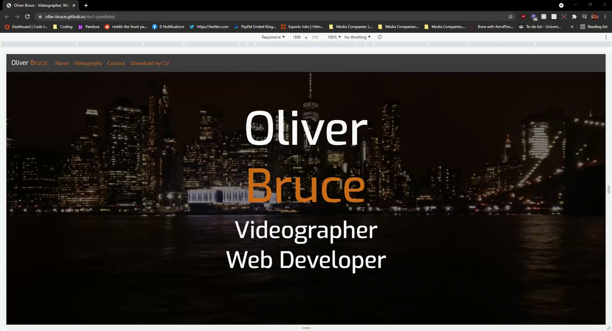
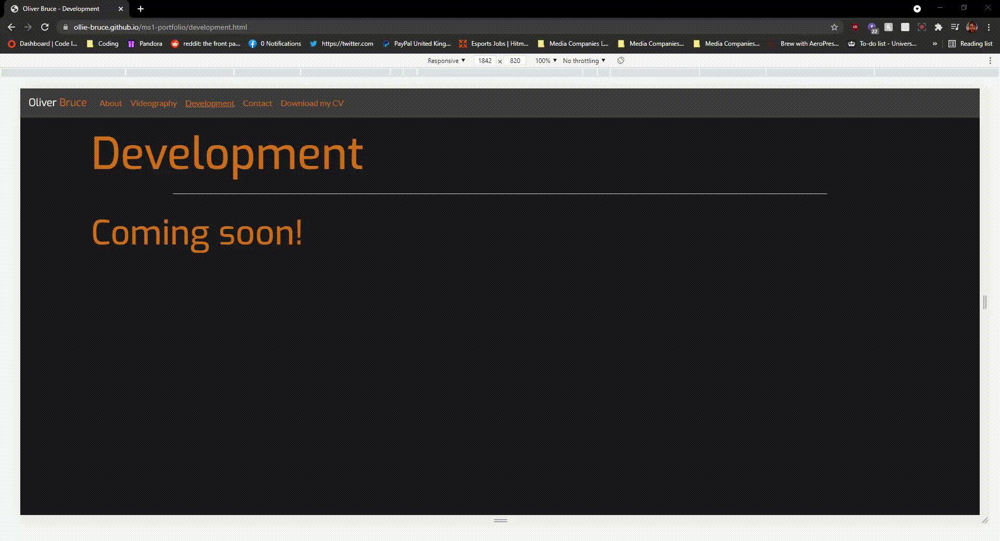
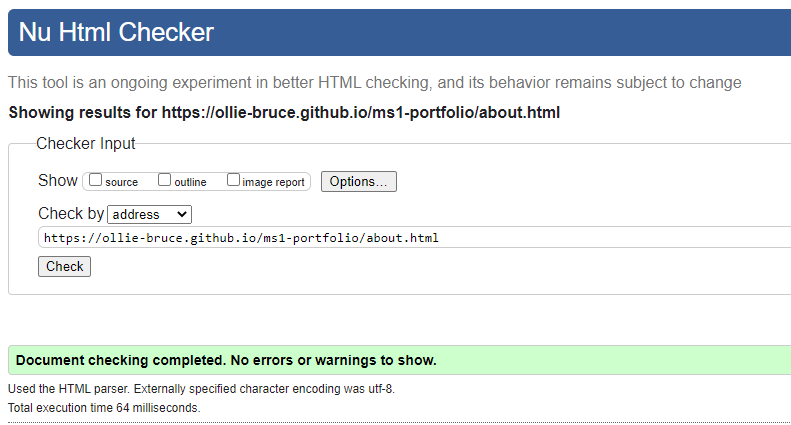

# Portfolio Site - Testing

## User Stories

### As Oliver:

* I am able to provide employers examples of my best work that is easy to navigate via both the Videography and Development pages.
* I am able to provide employers pertinent information about myself and my skills via the About page.
* I am able to provide ready access to my CV and contact information via an obvious download link the website's header and an easily-navigable Contact page.
* I now have a clean, easy-to-navigate portfolio website that is indicative of my skills at this point in my career.
* I have an easy-to-access archive of my work that I can easily refer to and edit using the documentation provided both via README.md and comments left in the code itself.

### As a future employer:

* I have easy access to the relevant parts of Oliver's portfolio with clear distinctions between Development and Videography.
* I can easily assess Oliver's skillset in a few moments by using the table on the About page
* I can download Oliver's CV separately for file-keeping and contact Oliver via the contact form or the information provided in his CV.
* I am able to determine some of Oliver's skillset from the website itself and navigating it as a user.

## Manual Testing

### Common Elements

These elements appear on every page identically and as such were tested once. 

* The navbar `hover` effect to confirm which links the user is about to click.

* Clicking on "Download my CV" will download the correct file without errors.

### Page Testing

#### Landing Page

Clicking the logo refreshes the landing page

Page responsiveness

#### About

Clicking the logo takes you back to the landing page

Page responsiveness

Skills table responsiveness

#### Videography

Clicking the logo takes you back to the landing page

Clicking on the video embeds starts the video player

Page responsiveness

#### Development

Clicking on the logo takes you back to the landing page

Page responsiveness

#### Contact

Clicking on the logo takes you back to the landing page

Text entry for each of the fields on the Contact form

Page responsiveness

## Automated Testing

### W3Schools Validator

#### Landing page

#### About

#### Videography

#### Development

#### Contact

#### CSS

### Lighthouse Audit

The full Lighthouse Audit can be found [here.](assets/testing/lighthouse-audit-ms1.pdf)

## User testing

The website and documentation were given to friends and family to provide feedback on any bugs present or usability issues. From this feedback, two main features were implemented:

* Adjusting the font sizes of main page titles for smaller screen sizes to increase readability (i.e. multi-word titles remaining on the same line)
* Stacking video embeds and their blurbs vertically on smaller screen sizes to help with readability and maintain a succinct layout.
